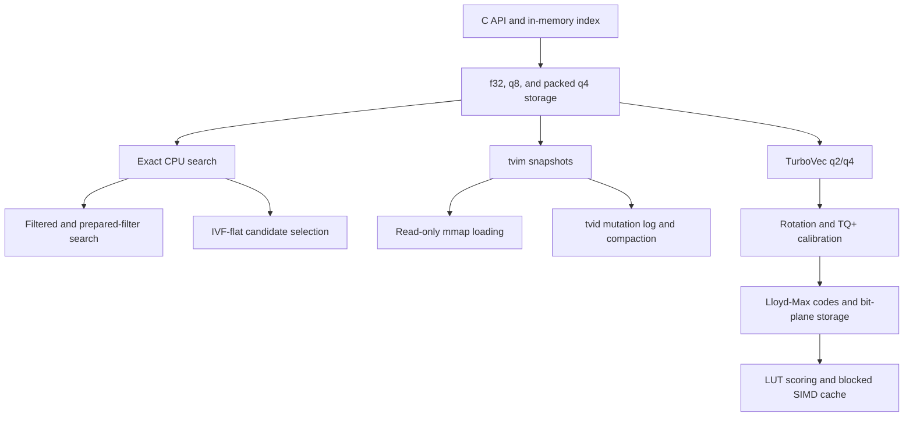

# Vector Index

`ggml-vector-index` is an opt-in C API for local vector search. It stores caller
provided ids with dense vectors and exposes exact top-k search over f32, q8, and
packed q4 storage.

This candidate component is currently standalone. It is not enabled in default
builds and is not wired into the llama runtime, server, or app paths. Consumers
should enable it explicitly and link the vector-index target directly.

## How The Pieces Fit

The vector index is organized as layers. The storage, search, and persistence
layers are general vector-index infrastructure; TurboVec is the q2/q4 algorithm
built on top of them.



The public C API owns the opaque index handle, caller-provided ids, vector
slots, mutations, and the top-k result contract. f32 storage and exact search
form the correctness baseline used to validate compressed or approximate paths.

Generic q8 and packed q4 modes reduce memory used by CPU-resident vectors. Each
vector stores an f32 scale, and search scores f32 queries directly against the
quantized codes. These modes also provide comparison points for TurboVec q2/q4
quality and performance.

Exact search scans every live slot. Filtered search restricts that scan to a
caller-provided id set, while prepared filters cache the id-to-slot mapping for
repeated queries. IVF-flat reduces the number of vectors scored by assigning
vectors and queries to in-memory centroid lists. It is an optional search
accelerator and does not change the storage format.

A `.tvim` file is a complete index snapshot. Normal loading materializes the
index in memory, while mmap loading keeps supported vector sections mapped
read-only for faster startup and lower memory duplication. A `.tvid` file
records incremental add and remove operations after a snapshot. Replay
reconstructs the latest state, and compaction replaces the snapshot and resets
the log. State identities and file locking prevent stale or concurrent writers
from silently producing a divergent index.

If compaction replaces the snapshot but cannot confirm its durability or reset
the delta log, it returns `GGML_VEC_INDEX_E_PARTIAL_COMPACT`.

TurboVec is a separate compressed search mode built on the same index API.
Vectors and queries are rotated into a quantization-friendly space. TQ+
calibration and Lloyd-Max codebooks produce q2 or q4 codes stored in bit-plane
rows. Search builds lookup tables from the rotated query and scores packed
codes without reconstructing full vectors. A blocked copy of the packed codes
supports scalar, NEON, and AVX2 scoring. Derived rotation, calibration,
blocked-code, and IVF state is invalidated or rebuilt after mutations,
compaction, and snapshot loading.

Each layer carries its own regression coverage: result ordering, architecture
parity, snapshot corruption, mmap restrictions, delta replay, compaction, stale
writers, hardlink aliases, torn-header recovery, cross-process locking,
TurboVec golden fixtures, cache invalidation, benchmark coverage, and package
smoke tests.

## Build

Enable the library with `GGML_VECTOR_INDEX`:

```sh
cmake -B build -DGGML_VECTOR_INDEX=ON -DLLAMA_BUILD_TESTS=ON
cmake --build build --target ggml-vector-index test-vector-index
```

Installed CMake packages export the target as `ggml::vector-index`.

```cmake
target_link_libraries(my_target PRIVATE ggml::vector-index)
```

NEON kernels are selected automatically on supported ARM builds. On x86,
AVX2 kernels are built separately when `GGML_NATIVE=ON` or `GGML_AVX2=ON` and
are selected at runtime. Scalar and SIMD reduction order can produce small
score differences across CPU architectures.

## Storage Modes

Create an index with a fixed dimension and bit width:

- `bit_width=32`: full f32 vectors.
- `bit_width=8`: per-vector symmetric q8 storage with f32 scales.
- `bit_width=4`: per-vector symmetric packed q4 storage with f32 scales.

The generic q4/q8 layouts are local to vector-index and are not `ggml-quants`
block formats. They keep one scale per external vector for random row lookup,
delete/compact operations, and snapshot round trips.

`ggml_vec_index_create_turbovec_q2` and `ggml_vec_index_create_turbovec_q4`
create separate TurboQuant q2/q4 modes on 64-bit targets for positive
dimensions up to 1024 that are multiples of 8. They store Lloyd-Max q2/q4
codes in Rust-style bit-plane rows with one score-correction scale per vector.
Vectors and queries use a deterministic dense full-dimension Gaussian QR
rotation before LUT scoring. The rotation is materialized as a dense `dim x dim`
matrix on first use, so the current dense implementation rejects larger
dimensions for new indexes. Snapshots created by earlier releases with larger
dimensions can still be loaded and rewritten, but add, search, and IVF
operations return `GGML_VEC_INDEX_E_INVALID_ARG`.
`ggml_vec_index_prepare` is best-effort and does not report allocation status.
The first non-empty add fits TQ+ per-coordinate calibration when it contains at least
1000 vectors, then reuses that calibration for later adds. TurboVec snapshots
use `.tvim` v3 to persist the calibration. Regular snapshot write/load is
supported; mmap loading and logged mutations are reserved for a later format
update. Search also keeps a 32-vector blocked copy of the packed codes in memory
for NEON/AVX2 LUT scoring; this cache is updated after adds and rebuilt after
compaction and snapshot loading.

Search scores are dot products. The index does not normalize vectors internally.
For cosine similarity, normalize vectors before insertion and normalize queries
before search.

## Search Modes

- Exact search (`ggml_vec_index_search`) scans every live slot.
- Filtered search (`ggml_vec_index_search_filtered`) restricts that scan to
  caller-provided ids.
- Prepared-filter search (`ggml_vec_index_filter_create` and
  `ggml_vec_index_search_prepared_filtered`) caches the id-to-slot mapping for
  repeated calls. The source index must outlive the filter, and the filter may
  be used only with that same index handle. An `add` that inserts one or more
  vectors, a successful `remove`, or a `compact` that removes tombstones makes
  the filter stale. Subsequent searches with it return
  `GGML_VEC_INDEX_E_INVALID_ARG`.
- IVF-flat search (`ggml_vec_index_build_ivf` and
  `ggml_vec_index_search_ivf`) builds heap-owned state for approximate candidate
  selection. Call `ggml_vec_index_build_ivf` before the first IVF search.
  Rebuild it after loading an index, after an `add` that inserts one or more
  vectors, after a successful `remove`, and after a `compact` that removes
  tombstones. Until it is built or rebuilt, IVF search returns
  `GGML_VEC_INDEX_E_INVALID_ARG`. `nprobe` must be at least 1. Lower values
  search fewer lists and may return different results from exact search.
  Probing at least the number of built lists searches all lists, so candidate
  coverage matches exact search. IVF state is not persisted in snapshots.

`ggml_vec_index_prepare` is an optional cache warmup for TurboVec q2/q4
rotation and codebook state; other storage modes ignore it. New callers should
use `ggml_vec_index_build_ivf` when approximate-search preparation is needed.

Higher `nprobe` values search more lists and generally improve recall at higher
cost. IVF uses the same dot-product score as exact search, assigning vectors and
queries to arithmetic centroids with dot-product scoring. Low `nprobe` values
are a recall/latency heuristic; probing all built lists gives exact-search
candidate coverage. For cosine-like IVF behavior, normalize vectors before
insertion and normalize queries before search.

## Persistence

Snapshots use `.tvim`. Version 2 records the storage kind, ids, quantization
scales, vector bytes, and CRC32C checksums for accidental corruption detection.
The loader still accepts legacy v1 f32 snapshots; legacy `bit_width=8` files
are quantized to q8 on load.

`ggml_vec_index_load_mmap` maps the vector section of a version 2 snapshot
read-only and copies ids and scales into memory. Legacy v1 snapshots require
`ggml_vec_index_load`. Mmap-loaded handles allow search and IVF preparation,
but reject content mutations. Mmap loading requires a little-endian host because
mapped vector bytes are read directly; use `ggml_vec_index_load` on big-endian
hosts. On POSIX, the snapshot filesystem must support `flock`.

Delta logs use `.tvid`. Legacy v1 delta logs use a full-index CRC32C state
field. Replay validates every record CRC and checks the full legacy state once
at the committed tail. Newer logs use rolling state tokens, and v4 logs store
the full rolling state in each record. New logged mutations require v4; legacy
logs remain replay-only.

An index loaded with `ggml_vec_index_load_with_delta` is bound to that delta
log. Plain `add`, `remove`, `compact`, and snapshot `write` operations return
`GGML_VEC_INDEX_E_INVALID_ARG` on the bound handle.

`ggml_vec_index_add_logged` and `ggml_vec_index_remove_logged` append durable
mutations. Before starting a new log, establish the snapshot lineage with a
successful `ggml_vec_index_write` or `ggml_vec_index_load`. The first logged
mutation binds the handle to the delta log; later logged mutations and
`ggml_vec_index_compact_delta` must use that same file. Equivalent hardlink
aliases identify the same log.

An I/O or durability failure can occur after a complete record was written. In
that case the in-memory mutation remains applied, and the handle may reject
later logged mutations and delta compaction with `GGML_VEC_INDEX_E_IO`. Reload
the snapshot and delta log to revalidate the durable state before continuing.
`GGML_VEC_INDEX_E_NOT_DURABLE` means the record data was synced but directory
durability could not be confirmed. `GGML_VEC_INDEX_E_PARTIAL_COMPACT` means the
snapshot was replaced but its durability could not be confirmed, or resetting
the delta log failed.

TurboVec `.tvim` snapshots are llama.cpp vector-index containers, not Rust
`turbovec` `.tv` or Rust `IdMapIndex` `.tvim` files. The formats share the
`TVPI` magic in current fixtures, but their headers and payload layout differ:
llama.cpp uses a 32-byte vector-index header with storage kind, qparam,
calibration-byte, id, and checksum sections, while Rust `TurboQuantIndex` `.tv`
uses its own compact header and has no external-id section. `ggml_vec_index_load`
intentionally rejects Rust TurboVec files; rebuild the llama.cpp index from
vectors when interchange is needed.

Delta logs are bound to the state of the snapshot they extend. Use one evolving
writer handle for a given snapshot and delta path pair. If another handle or
process writes to the same log, stale writers catch up automatically when their
current state matches a committed intermediate log state. Otherwise, reload
from snapshot plus delta before appending again. A bound handle rejects logged
mutations or compaction with a different delta path. A successful catch-up
remains applied if the requested mutation then returns a duplicate or not-found
error. Loading validates each replayed record against its stored post-state
identity.

Cross-process append protection uses cooperative OS file locks. Keep `.tvid`
delta logs on local filesystems with reliable locking, and do not edit or append
to them outside the vector-index API.

After a handle has been loaded with a delta log or has used logged mutations,
content changes must continue through `ggml_vec_index_add_logged`,
`ggml_vec_index_remove_logged`, or `ggml_vec_index_compact_delta`. Plain
add/remove/compact calls and ordinary snapshot writes are rejected on
delta-bound handles.

Readers still accept legacy v1/v2 delta logs. New q4/q8 adds are not appended
to those f32-payload log formats; compact first so subsequent quantized adds use
native-code v4 records.

## mmap Loading

`ggml_vec_index_load_mmap` loads a v2 snapshot with the vector section mapped
read-only. Ids and quantization scales are copied into memory.

On mmap-backed handles:

- Search APIs are allowed.
- `ggml_vec_index_build_ivf` is allowed because it only builds heap-owned search
  state.
- Index-content mutations such as add, remove, compact, and logged mutations
  return `GGML_VEC_INDEX_E_INVALID_ARG`.
- `ggml_vec_index_write` is allowed only when writing to a path different from
  the mapped source file and the handle is not delta-bound.
- `ggml_vec_index_compact_delta` is allowed when writing the compacted snapshot
  to a path different from the mapped source file; it rebuilds the state identity
  before replacing the delta log.

The mmap loader is snapshot-only and does not replay `.tvid` delta logs. Use
`ggml_vec_index_load_with_delta` when delta replay is needed.

The persisted formats are little-endian. Regular load paths decode fields into
host values; mmap loading requires a little-endian host because vector bytes are
read directly from the mapped file.

## Threading

Read-only APIs on the same handle can run concurrently. Mutations, persistence
writes, compaction, and IVF builds are serialized with reads and with each
other. The caller must keep index and prepared-filter handles alive for the full
duration of every API call that uses them.

## Tests and Benchmark

Run the regression tests:

```sh
cmake --build build --target test-vector-index test-vector-index-faults
./build/bin/test-vector-index
./build/bin/test-vector-index-faults
```

Run the synthetic benchmark:

```sh
cmake --build build --target bench-vector-index
./build/bin/bench-vector-index
```

The benchmark reports q8/q4 quality against f32 exact search, exact and IVF
latency, mmap load timing, delta replay/compaction timing, and delete-heavy
behavior.
