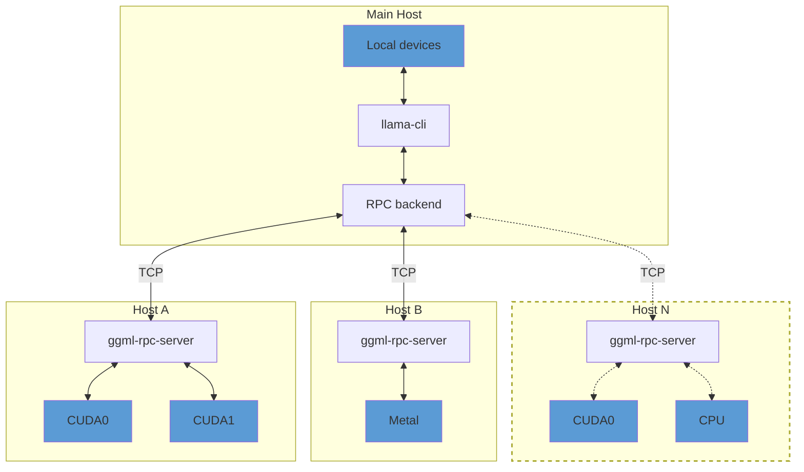

## Overview

> [!IMPORTANT]
> This example and the RPC backend are currently in a proof-of-concept development stage. As such, the functionality is fragile and
> insecure. **Never run the RPC server on an open network or in a sensitive environment!**

The `ggml-rpc-server` allows exposing `ggml` devices on a remote host.
The RPC backend communicates with one or several instances of `ggml-rpc-server` and offloads computations to them.
This can be used for distributed LLM inference with `llama.cpp` in the following way:



By default, `ggml-rpc-server` exposes all available accelerator devices on the host.
If there are no accelerators, it exposes a single `CPU` device.

## Usage

### Remote hosts

On each remote host, build the backends for each accelerator by adding `-DGGML_RPC=ON` to the build options.
For example, to build the `ggml-rpc-server` with support for CUDA accelerators:

```bash
mkdir build-rpc-cuda
cd build-rpc-cuda
cmake .. -DGGML_CUDA=ON -DGGML_RPC=ON
cmake --build . --config Release
```

When started, the `ggml-rpc-server` will detect and expose all available `CUDA` devices:

```bash
$ bin/ggml-rpc-server
ggml_cuda_init: GGML_CUDA_FORCE_MMQ:    no
ggml_cuda_init: GGML_CUDA_FORCE_CUBLAS: no
ggml_cuda_init: found 1 CUDA devices:
  Device 0: NVIDIA GeForce RTX 5090, compute capability 12.0, VMM: yes
Starting RPC server v7.0.0
  endpoint       : 127.0.0.1:50052
  local cache    : n/a
Devices:
  CUDA0: NVIDIA GeForce RTX 5090 (32109 MiB, 31588 MiB free)
```

You can control the set of exposed CUDA devices with the `CUDA_VISIBLE_DEVICES` environment variable or the `--device` command line option. The following two commands have the same effect:
```bash
$ CUDA_VISIBLE_DEVICES=0 bin/ggml-rpc-server -p 50052
$ bin/ggml-rpc-server --device CUDA0 -p 50052
```

### Main host

On the main host build `llama.cpp` with the backends for the local devices and add `-DGGML_RPC=ON` to the build options.
Finally, when running `llama-cli` or `llama-server`, use the `--rpc` option to specify the host and port of each `ggml-rpc-server`:

```bash
$ llama-cli -hf ggml-org/gemma-3-1b-it-GGUF -ngl 99 --rpc 192.168.88.10:50052,192.168.88.11:50052
```

By default, llama.cpp distributes model weights and the KV cache across all available devices -- both local and remote -- in proportion to each device's available memory.
You can override this behavior with the `--tensor-split` option and set custom proportions when splitting tensor data across devices.

### Pipeline parallelism

Protocol 7 supports asynchronous RPC transfers and events, allowing `--split-mode layer` to overlap ubatches across remote devices. The client and all servers must use protocol 7.

Run one RPC server endpoint per pipeline stage. A server handles one client connection serially, so devices exposed by the same server process are not pipelined with each other.

For example, start one server per GPU:

```bash
# host 1
bin/ggml-rpc-server -H 192.168.88.10 -p 50052 --device CUDA0

# host 2
bin/ggml-rpc-server -H 192.168.88.11 -p 50052 --device CUDA0
```

Then use both endpoints in layer split mode:

```bash
llama-cli -m model.gguf \
    --rpc 192.168.88.10:50052,192.168.88.11:50052 \
    --device RPC0,RPC1 \
    --split-mode layer \
    --tensor-split 1,1 \
    --n-gpu-layers all \
    --batch-size 2048 \
    --ubatch-size 256
```

Using a batch larger than the ubatch gives the scheduler enough independent work to overlap the pipeline stages.

### Local cache

The RPC server can use a local cache to store large tensors and avoid transferring them over the network.
This can speed up model loading significantly, especially when using large models.
To enable the cache, use the `-c` option:

```bash
$ bin/ggml-rpc-server -c
```

By default, the cache is stored in the `$HOME/.cache/llama.cpp/rpc` directory and can be controlled via the `LLAMA_CACHE` environment variable.

### RDMA transport

The RPC backend can use RDMA instead of TCP for lower latency and higher throughput. The transport is negotiated during the initial handshake -- no changes to command-line usage are required, and the connection falls back to TCP unless both peers can use RDMA.

Two providers are supported, each enabled by default when its library is found at build time:

- **Linux**: RoCEv2-capable NICs (e.g. Mellanox ConnectX), via `libibverbs`.
- **macOS**: RDMA over Thunderbolt on Apple silicon Macs with Thunderbolt 5, via `librdma`. Requires macOS 26.2 or later, with RDMA enabled once from macOS Recovery via `rdma_ctl enable`. See [TN3205](https://developer.apple.com/documentation/technotes/tn3205-low-latency-communication-with-rdma-over-thunderbolt).

RDMA is point-to-point, so each side uses the local device whose GID matches the address the connection was made on. Connect over the RDMA-capable link -- with Thunderbolt, use the peer's Thunderbolt address in `--rpc`; a connection made over another interface stays on TCP.

To force plain TCP without rebuilding, set `GGML_RPC_NO_RDMA` on either peer:
```bash
$ GGML_RPC_NO_RDMA=1 bin/ggml-rpc-server
```

### Direct all-reduce

Tensor split with a power-of-two number of RPC devices (2, 4, 8, 16, ...) uses recursive-doubling (butterfly) all-reduce. In round `k`, rank `r` exchanges its accumulated tensor with rank `r XOR (1 << k)` and adds the received sum. After `log2(N)` rounds, every rank has the full sum. Tensor data travels directly between servers, without passing through the main host. Each rank sends a full tensor per round; this is not a bandwidth-optimal reduce-scatter/all-gather algorithm for large tensors.

Use one RPC endpoint per rank. In each pair, the lower rank listens on its RPC port plus 1000 and the higher rank connects to it. Each listener reuses its port across rounds. Set `GGML_RPC_COMM_PORT` on the main host to override this with a base port: rank `r` listens on `base + r`. Reserve that range when running multiple endpoints on the same host.

The client and all servers must use RPC protocol **108**. The communicator initialization and peer frames changed, so protocol 107 builds cannot participate. Other rank counts, mixed local/RPC backends, and unsupported tensors continue to use fallback. Direct reduction requires contiguous F32 tensors with active compute flags on every rank; a single rank needs no collective.

Allow the communication port through the firewall and ensure that the servers can connect to each other. Use this only on a trusted private network because the connection does not provide transport authentication or encryption. Set `GGML_RPC_NO_COMM=1` on the main host to disable direct all-reduce.

#### Testing direct all-reduce

Graph and collective commands are queued asynchronously; synchronization and readback report deferred transport failures. While a direct communicator is active, its client dispatchers busy-poll to reduce command latency. This trades CPU time for lower dispatch latency. Set `GGML_RPC_NO_BUSY_SPIN=1` on the main host to use sleeping dispatchers for an A/B comparison. Polling stops when the last shared communicator handle is released.

The local test runner starts isolated CPU RPC servers; it needs Python 3 but no GPU or model:

```bash
cmake -S . -B build-rpc-test -DGGML_RPC=ON -DLLAMA_BUILD_TESTS=ON -DLLAMA_BUILD_TOOLS=ON
cmake --build build-rpc-test --target ggml-rpc-server test-rpc-allreduce test-rpc -j
ctest --test-dir build-rpc-test -R '^test-rpc-(allreduce-|local$)' --output-on-failure
```

This covers 2, 4, and 8 ranks with F32 and BF16 wire transfers, small/large and odd tensor lengths, random reference sums, queued reductions, communicator reuse/reinitialization, unsupported inputs, port overrides, and recovery after partial initialization failure. The tests call the communicator directly and fail if it cannot initialize or reduce, so fallback cannot hide a failure.

To test more local ranks, or existing servers on separate machines:

```bash
python3 tests/test_rpc_allreduce.py --server build-rpc-test/bin/ggml-rpc-server \
    --client build-rpc-test/bin/test-rpc-allreduce --ranks 16 --wire f32

GGML_RPC_NO_WIRE_BF16=1 build-rpc-test/bin/test-rpc-allreduce \
    node0:50052 node1:50052 node2:50052 node3:50052
```

With a CUDA-enabled server build, add `--device CUDA0` to the local runner to exercise GPU transfers and reductions. All local ranks then share that GPU; this checks correctness, not multi-machine performance.

For an inference comparison, use the same model, devices, tensor split, prompt and generation lengths with `--split-mode tensor`. Compare the default direct path against a run with `GGML_RPC_NO_COMM=1`, measuring prompt processing and generation separately. The initialization log reports `butterfly communicator initialized (N ranks, K rounds)`; individual unsupported reductions may still fall back. Start correctness comparisons with `GGML_RPC_NO_WIRE_BF16=1`, then evaluate BF16 separately because its rounding accumulates across rounds.

### Troubleshooting

Use the `GGML_RPC_DEBUG` environment variable to enable debug messages from `ggml-rpc-server`:
```bash
$ GGML_RPC_DEBUG=1 bin/ggml-rpc-server
```

Set `GGML_RPC_NO_WIRE_BF16=1` on the main host to keep direct all-reduce transfers in F32. By default, large F32 all-reduce tensors use BF16 on the wire to reduce peer traffic.
